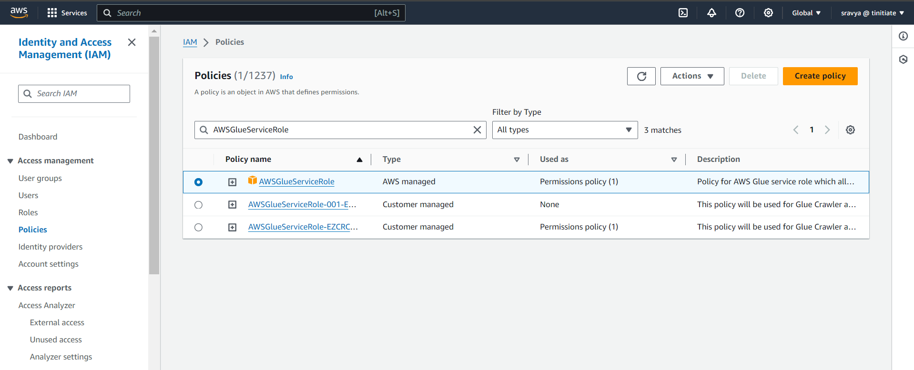

# Crawler prerequisites:
AWS Glue crawlers rely on an IAM role to perform their data discovery and schema inference tasks. The role needs permissions for the following:

* Access AWS Glue: Permissions to list, create, and update crawlers within the Glue service.
* Access Data Sources: Permissions to access the data stores that the crawler will be exploring. Here are some specific examples:
	- S3 Bucket Read Access: If the crawler needs to crawl data from S3 buckets, the IAM role needs appropriate read permissions for those buckets.
	- Database Connection Permissions: For relational databases (e.g., MySQL, Oracle), the role requires connection permissions to establish a connection and retrieve data.
* Data Catalog Access: In some scenarios, the crawler might need permissions to write metadata to the AWS Glue Data Catalog.

## Creating an IAM Role for Glue Crawlers:
### Step 1. Accessing the IAM Service:
- Log in to the AWS Management Console.
- In the navigation pane on the left side of the page, locate the "IAM" service and click on it.
  
### Step 2. Creating the IAM Role:
- Under IAM services, click on "Roles" from the left-hand sidebar.
- Click the "Create role" button.
- In the "Choose a role type" section, select "AWS service".
- From the list of services, choose "Glue".
- Click "Next: Permissions".
  
### Step 3. Attaching Permissions:
Here, we'll define two separate policy documents to grant the required permissions:

#### a) S3 Access Policy:

- Click on the "Create policy" button.
    
- In the policy editor, choose the "JSON" tab.
    
- Paste the following JSON code snippet into the editor:
  
  ```json
    	 {
    		"Version": "2012-10-17",
    		"Statement": [
    			{
    				"Effect": "Allow",
    				"Action": [
    					"s3:GetObject",
    					"s3:PutObject"
    				],
    				"Resource": "arn:aws:s3:::tini-d-gluebucket-001*"
    			}
    		]
    	}
  ```

  *Important Note:*

- Replace <your-bucket-name> with the actual name of the S3 bucket(s) your crawler needs to access. You can use wildcards (*) for specific prefixes within the bucket.
- This policy allows the crawler to read data (GetObject) and potentially write temporary files (PutObject) during the crawling process.
- Enter a descriptive name for your policy (e.g., "S3AccessForGlueCrawler") and click "Create policy".

#### b) Glue Service Role Policy:

* Click on the "Attach existing policies" button.
* In the search bar, type "AWSGlueServiceRole" and select the policy.
  
* Click "Attach policy".
* Below Json policy is for Glue Service Role
  ```json
  {
  		"Version": "2012-10-17",
  		"Statement": [
  			{
  				"Effect": "Allow",
  				"Action": [
  					"glue:*",
  					"s3:GetBucketLocation",
  					"s3:ListBucket",
  					"s3:ListAllMyBuckets",
  					"s3:GetBucketAcl",
  					"iam:ListRolePolicies",
  					"iam:GetRole",
  					"iam:GetRolePolicy",
  					"cloudwatch:PutMetricData"
  				],
  				"Resource": [
  					"*"
  				]
  			},
     {
  				"Effect": "Allow",
  				"Action": [
  					"s3:GetObject",
  					"s3:PutObject"
  				],
  				"Resource": [
  					"arn:aws:s3:::aws-glue-*/*",
  					"arn:aws:s3:::*/*aws-glue-*/*"
  				]
  			},
     {
  				"Effect": "Allow",
  				"Action": [
  					"s3:GetObject"
  				],
  				"Resource": [
  					"arn:aws:s3:::crawler-public*",
  					"arn:aws:s3:::aws-glue-*"
  				]
  			},
     {
  				"Effect": "Allow",
  				"Action": [
  					"logs:CreateLogGroup",
  					"logs:CreateLogStream",
  					"logs:PutLogEvents"
  				],
      "Resource": [
  					"arn:aws:logs:*:*:*:/aws-glue/*"
  				]
  			}
  		]
  	}
  ```
  ### Step 4. Finalizing the IAM Role:
* Review the attached policies and click "Next: Tags" (optional: add tags for better organization).
  
* Click "Next: Review" to review the role details and permissions.
  
* Enter a name for your IAM role (e.g., "GlueCrawlerRole") and click "Create role".

## Create Crawler Roles for the policies created
### Step 1: Go to IAM (Identity and Access Management) , 
* click the roles tab on the left side of the page and click on create role
   
### Step 2: Required Parameters:
  	1. select the trusted entity as below image, for trusted entity type, select AWS service 
    	2. For Use case, select Glue
    	3. Click Next 
   
### Step 3: Add Permissions 
	1. select the policies created for S3
	2. Select the policies created for Glue 
	3. Click Next
   
### Step 4: Adding Role Name
	1. The policy for S3
	2. The policy for Glue are attached
	3. Enter a Unique Role name
	4. Click Next.
   
