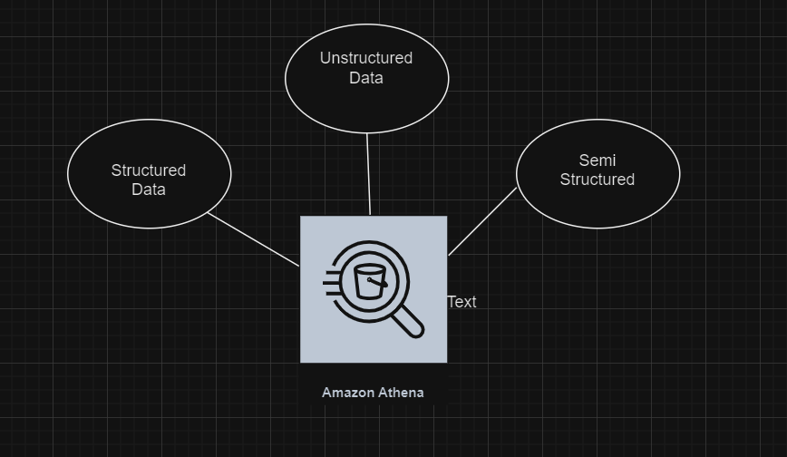
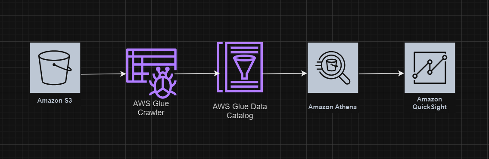

# Athena 

Amazon Athena is an interactive query service that makes it easy to analyze data directly in Amazon Simple Storage Service (Amazon S3) using standard SQL. It's serverless, so there's no infrastructure to manage, and you only pay for the queries that you run. Athena is highly appealing for users ranging from seasoned data analysts to beginners due to its simplicity and integration with other AWS services.

## Key Features of Amazon Athena
- Serverless: Athena is serverless, meaning you don't need to set up, manage, or scale any infrastructure. You focus solely on writing queries and analyzing your data.

- SQL-Based: Athena allows you to use standard SQL expressions and functions to query your data. This makes it accessible to anyone with SQL knowledge and minimizes the learning curve for new users.

- Easy Integration: Athena is tightly integrated with AWS Glue, a managed ETL (Extract, Transform, Load) and data catalog service. AWS Glue can create and manage a data catalog that is used by Athena to run queries against the available data.

- Built-in with Amazon S3: Directly designed to query data stored in Amazon S3, Athena is ideal for analyzing large-scale datasets without the need for data movement or transformation.

- Wide Range of Data Formats: Supports various data formats such as CSV, JSON, ORC, Avro, and Parquet. Athena can handle both structured and semi-structured data, making it versatile for different data analytics needs.

- Pay-Per-Query: Costs are based only on the queries you execute, calculated by the amount of data scanned by each query. This can be cost-effective, especially with proper data management and query optimization techniques.

## When Should Athena be used?

- Ad-Hoc Querying of Log Data:
  Athena is ideal for querying log data stored in S3. Organizations often store web server logs, application logs, or event logs in S3, and Athena allows analysts to run 
  queries directly on this data to monitor application performance, user activities, or system anomalies.

-  Data Lake Exploration:
  For organizations utilizing a data lake architecture, Athena helps in querying and analyzing data stored in S3 as part of a data lake. This includes structured, semi- 
  structured, and unstructured data. Athena enables quick SQL queries across diverse datasets without the need to transform or load the data into a separate analytics system.
  

    
  

- Quick BI Reporting:
  Athena integrates with popular BI tools via ODBC/JDBC drivers, enabling fast and effective business intelligence reporting. Businesses can use Athena for real-time 
  reporting on data stored in S3, creating dashboards that pull live data for up-to-date insights.

## How will Athena work?
  

    
  

AWS Glue Crawler: Walks through your data stores, looks at all the data, and takes notes about what it finds (like the types of data and their organization).
AWS Glue Data Catalog: Stores these notes in an organized manner, making it easy for you and other AWS services to understand and use the data efficiently.

## Common Use Cases
- Ad-hoc Analysis: Quickly run ad-hoc queries against large-scale datasets. Analysts use Athena for data exploration and quick checks without needing to set up complex data processing infrastructure.

- Log Analysis: Commonly used for querying logs stored in S3, such as application logs, system logs, and web server logs. This helps in monitoring, troubleshooting, and the optimization of applications.

- Data Lake Queries: Execute queries on data lakes stored in S3. Athena helps in extracting insights from large pools of raw data stored in a distributed manner.

- Business Intelligence and Reporting: Integrated with various BI tools via JDBC/ODBC, Athena facilitates reporting and visual analytics, allowing businesses to make informed decisions based on the latest data.

## Athena Cost Model:

* Pay-Per-Query Pricing: Athena charges based on the amount of data scanned by your queries. You pay for the amount of data scanned in each query execution.
* No Data Loading or ETL Costs: Since Athena queries data directly in S3, there are no additional costs associated with data loading, transformation, or ETL processes
* Free Query Cancellation: You are not charged for queries if they are cancelled before any data is processed.
* Query Result Caching: Athena provides query result caching that can help reduce costs and improve performance for repeated queries over the same data.
* Data Transfer Costs: There are no additional data transfer fees for data scanned by Athena within the same AWS region. However, if query results are exported out of the 
  AWS region, standard AWS data transfer rates apply.
