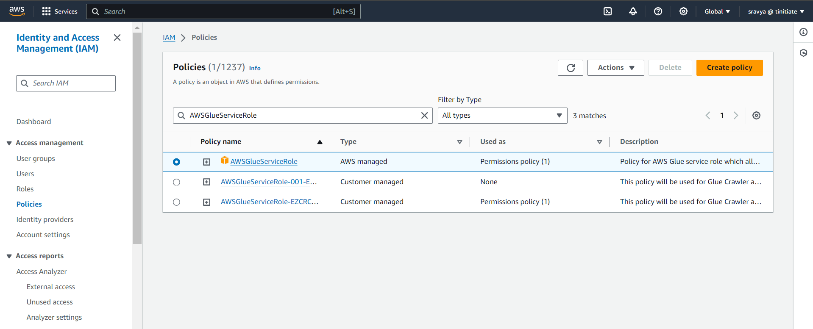

# AWS Glue Crawler

This section dives into AWS Glue Crawlers and Classifiers, essential components for automating data discovery, classification, and cataloging within your data pipelines.

Crawlers act as automated data scouts, exploring and scanning various data sources supported by AWS Glue, including:

1. Amazon S3 buckets (most common)
2. Relational databases (e.g., MySQL, Oracle)
3. Data warehouses (e.g., Redshift)

## Crawler Functionalities:
* *Data Source Discovery:* Crawlers automatically identify data locations within your specified sources.
* *Schema Inference:* During a crawl, the crawler analyzes the data to infer its schema (structure). This includes determining data types for each column and understanding the overall organization.
* *Metadata Generation:* Based on the inferred schema and details like location and format, the crawler generates metadata entries within the AWS Glue Data Catalog. This central registry acts as a catalog for your data assets, simplifying discovery and management.
* *Schema Evolution Handling:* Crawlers can be configured to adapt to evolving data formats. If your data structure changes (e.g., adding new columns), the crawler detects these changes and updates the corresponding metadata in the Data Catalog.
* *Scheduling:* Crawlers can be run on demand or scheduled to run periodically (e.g., daily, weekly) to ensure the Data Catalog stays up-to-date with changes in your data sources.

## Role of Classifiers:
Classifiers work alongside crawlers to accurately understand the format of your data:
* *Data Format Detectives:* Classifiers are sets of rules or patterns that the crawler uses to identify the format of the data it encounters. AWS Glue provides built-in classifiers for common formats like CSV, JSON, Avro, and Parquet. You can also define custom classifiers for less common formats or specific needs.
* *Classifier Workflow:* When a crawler scans a data source, it invokes its associated classifiers in a predefined order:
	1. Crawlers first try built-in classifiers to recognize the format.
	2. If no built-in classifier provides a confident match, the crawler attempts any custom classifiers defined for that source.

## Supported Data Stores for AWS Glue Crawlers
| Connection Method  | Data stores     | 
| :-------- | :------- | 
| Native client | Amazon Simple Storage Service (Amazon S3)
|                      | Amazon DynamoDB |  
| JDBC | Amazon Redshift |
|           | Snowflake |  
|           | Amazon Aurora |  
|           | Maria DB |  
|           | Microsoft SQL Server |  
|           | MySQL | 
|           | Oracle |  
|           | PostgreSQL |
| MongoDB Client          | MongoDB |
|           | MongoDB Atlas|
|           | Amazon DocumentDB |

## Crawler prerequisites:

AWS Glue crawlers rely on an IAM role to perform their data discovery and schema inference tasks. The role needs permissions for the following:

* Access AWS Glue: Permissions to list, create, and update crawlers within the Glue service.
* Access Data Sources: Permissions to access the data stores that the crawler will be exploring. Here are some specific examples:
	- S3 Bucket Read Access: If the crawler needs to crawl data from S3 buckets, the IAM role needs appropriate read permissions for those buckets.
	- Database Connection Permissions: For relational databases (e.g., MySQL, Oracle), the role requires connection permissions to establish a connection and retrieve data.
* Data Catalog Access: In some scenarios, the crawler might need permissions to write metadata to the AWS Glue Data Catalog.

### Creating an IAM Role for Glue Crawlers:
#### Step 1. Accessing the IAM Service:
- Log in to the AWS Management Console.
- In the navigation pane on the left side of the page, locate the "IAM" service and click on it.
#### Step 2. Creating the IAM Role:
- Under IAM services, click on "Roles" from the left-hand sidebar.
- Click the "Create role" button.
- In the "Choose a role type" section, select "AWS service".
- From the list of services, choose "Glue".
- Click "Next: Permissions".
#### Step 3. Attaching Permissions:
Here, we'll define two separate policy documents to grant the required permissions:

a) S3 Access Policy:

- Click on the "Create policy" button.
  
  
- In the policy editor, choose the "JSON" tab.
  
- Paste the following JSON code snippet into the editor:
 ```json
	 {
		"Version": "2012-10-17",
		"Statement": [
			{
				"Effect": "Allow",
				"Action": [
					"s3:GetObject",
					"s3:PutObject"
				],
				"Resource": "arn:aws:s3:::tini-d-gluebucket-001*"
			}
		]
	}
```

Important Note:

- Replace <your-bucket-name> with the actual name of the S3 bucket(s) your crawler needs to access. You can use wildcards (*) for specific prefixes within the bucket.
- This policy allows the crawler to read data (GetObject) and potentially write temporary files (PutObject) during the crawling process.
- Enter a descriptive name for your policy (e.g., "S3AccessForGlueCrawler") and click "Create policy".

b) Glue Service Role Policy:

* Click on the "Attach existing policies" button.
* In the search bar, type "AWSGlueServiceRole" and select the policy.
  
* Click "Attach policy".
* Below Json policy is for Glue Service Role
```json
{
		"Version": "2012-10-17",
		"Statement": [
			{
				"Effect": "Allow",
				"Action": [
					"glue:*",
					"s3:GetBucketLocation",
					"s3:ListBucket",
					"s3:ListAllMyBuckets",
					"s3:GetBucketAcl",
					"iam:ListRolePolicies",
					"iam:GetRole",
					"iam:GetRolePolicy",
					"cloudwatch:PutMetricData"
				],
				"Resource": [
					"*"
				]
			},
			{
				"Effect": "Allow",
				"Action": [
					"s3:GetObject",
					"s3:PutObject"
				],
				"Resource": [
					"arn:aws:s3:::aws-glue-*/*",
					"arn:aws:s3:::*/*aws-glue-*/*"
				]
			},
			{
				"Effect": "Allow",
				"Action": [
					"s3:GetObject"
				],
				"Resource": [
					"arn:aws:s3:::crawler-public*",
					"arn:aws:s3:::aws-glue-*"
				]
			},
			{
				"Effect": "Allow",
				"Action": [
					"logs:CreateLogGroup",
					"logs:CreateLogStream",
					"logs:PutLogEvents"
				],
				"Resource": [
					"arn:aws:logs:*:*:*:/aws-glue/*"
				]
			}
		]
	}
```
#### Step 4. Finalizing the IAM Role:
* Review the attached policies and click "Next: Tags" (optional: add tags for better organization).
  
* Click "Next: Review" to review the role details and permissions.
  
* Enter a name for your IAM role (e.g., "GlueCrawlerRole") and click "Create role".


### Create Crawler Roles for the policies created
* Step 1: Go to IAM (Identity and Access Management) , click the roles tab on the left side of the page and click on create role
   
* Step 2: Required Parameters:
  	1. select the trusted entity as below image, for trusted entity type, select AWS service 
    	2. For Use case, select Glue
    	3. Click Next 
   
* Step 3: Add Permissions 
	1. select the policies created for S3
	2. Select the policies created for Glue 
	3. Click Next
   
* Step 4: Adding Role Name
	1. The policy for S3
	2. The policy for Glue are attached
	3. Enter a Unique Role name
	4. Click Next.
   


## Glue Catalog
#### Step 1: Go to AWS Glue, click the crawlers tab on the left side of the page ,click create crawler.
   1. Click Crawler tab
   2. Click Create Crawler
    
 
* Set Crawler properties
   1. Name :: Enter Unique Name for the Crawler
   2. Click Next
       

* Choose the data source and classifiers,Data source configuration , Add a 
   data source.
   1. Select S3 as a Data Source
   2. Select S3 bucket path
   3. crawl all the folders(it will crawl all subfolder, you choose according to your requirement)
   4. Add a Data Source


  
  
 
  * Configure Security Setting
   1. Choose the existing IAM role for crawler
   2. Click Next
   

  * Set Output and Scheduling
   1. Select the Target Database, we have already created glue_db . 
   2. If Database is not created then click Add Database to create one.
   3. select the frequency on which the crawler to run. 
   4. Click next
   

  * Crawler Schedule, you can select the crawler schedule  
    on how to run it, below you can choose anyone.
    
     
  * Once you select scheduler, then click next and review 
   the full setting before clicking finish. It will create a crawler to move the data from S3 to Data 	 
   Catalog
     

  * Once the Crawler is created, please select Run 
    Crawler and once it is completed it will display as below.
  1. Click Crawler.
  2. Start time , this will display the start time for the  
      crawler.
  3. End time, this will display the end time for the crawler.
  4. Status , this will display the status of the crawler job.
  
   

  * Crawler S3
    * `Source` CSV `Target` CSV
    * `Source` JSON `Target` JSON
    * `Source` Parquet `Target` Parquet
    * `Source` ION `Target` ION
        * New File [Do this with AWS Lambda]
        * Add Rows [Do this with AWS Lambda]
        * Remove Rows [Do this with AWS Lambda]
           
* Crawler DB
    * Crawler On single tables
    * Crawler On PK-FK tables
    * Crawler On View
* Crawler Dynamo
* Crawler Metrics (Stats like DB Tables, last crawled datetime, PCT scanned, Pending time for Crawl)
* Crawler performance tuning
