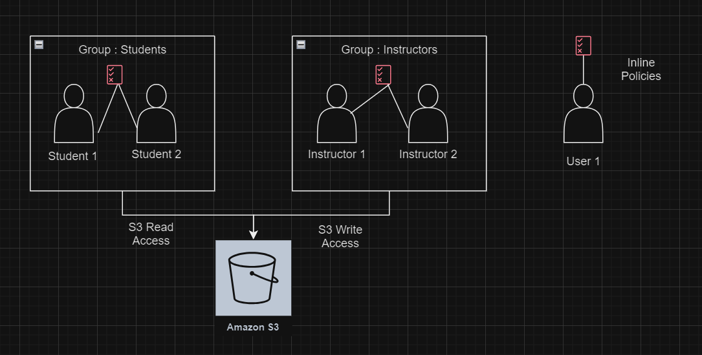

# AWS Identity and Access Management (IAM)

## Overview
* Identity and Access Management, Global service - controls access to AWS and its resources.
* Enables you to manage access to AWS services and resources securely. 
* Using IAM, you can create and manage AWS users and groups, and use permissions to allow and deny their access to AWS resources.

In essence, IAM helps you control who can access what within your AWS cloud environment, ensuring security and compliance.

## IAM Core Components

### 1. IAM Users
- **Description**: An IAM user is a resource in IAM that has associated credentials and permissions. An IAM user can represent a person or an application that uses its credentials to make AWS requests. 
- **Common Uses**:
  - Accessing AWS Management Console.
  - Interacting with AWS services programmatically via the API.
    
### 2. IAM User Groups
- **Description**: An IAM group is an identity that specifies a collection of IAM users. You can use groups to specify permissions for multiple users at a time. Groups make permissions easier to manage for large sets of users.
- **Common Uses**:
  - Simplifying permission management for multiple users.
  - Organizing users by department or role (e.g., students group, instructors group).

<p align="center">
  
</p>

#### IAM Permissions
- **Description**: Defines what actions are allowed or denied on users, user groups and aws resources.
- **Common Uses**:
  - Restricting access to specific AWS services or functionalities (e.g., allowing read-only access to an S3 bucket).
  - Controlling the level of access a user or service has (e.g., granting full access vs. read-only access).

### 3. IAM Policies
- **Description**: JSON Documents that define permissions and can be attached to users, groups, roles, or even resources.
- **Common Uses**:
  - Specifying allowed or denied actions and the conditions under which actions are allowed for a user, group, role, or resource.
  - Managing permissions centrally through policy documents which helps in achieving consistent security posture across resources.

<p align="center">
  
</p>

Before proceeding with hands on, let's get an quick understanding on 

#### What is an S3 Bucket? 

* An S3 bucket is a virtual container within AWS Simple Storage Service (S3) designed to store and manage any amount of data.
* Amazon S3 is represented by:
  - **Buckets**: Containers for storing objects.
  - **Objects**: Individual data files stored in buckets.
* Sample Bucket path :
  
  ```text
  s3://ti-author-data/customer-billing/
  ```

### Hands On - Users and User Groups
Step 1: As Shown in the above image, lets create 2 user groups Students, Instructors with Student 1 and Instructor 1 as the users in the AWS Console.
Step 2: For the Students Groups, Lets assign S3 bucket Read access only
Step 3: For the Instructors Groups, Lets assign S3 bucket full access, as they can upload, delete and view those files.
Step 4: Now create user - Student01, assign it to the Students Group created, This Student will have the S3 bucket Read access only.
Step 5: Create user - Instructore01, assign it to the Instructors Group created, they will have full access on S3.

We can notice that, an instrcutor can upload the file, delete the file and modify the file, create buckets.
The student can download the file uploaded in S3 by the instructor, but cannot create buckets. 


Here's an example of a policy structure that grants read-only access to an S3 bucket for Students User Group

```json
{
  "Version": "2012-10-17",
  "Statement": [
    {
      "Effect": "Allow",
      "Action": ["s3:Get*", "s3:List*"],
      "Resource": ["arn:aws:s3:::example-bucket/*"]
    }
  ]
}
```
  
### 4. IAM Roles
- **Description**: Enables you to delegate permissions to AWS services or external users.
- **Common Uses**:
  - Granting permissions to AWS services like Lambda functions to interact with other AWS resources without needing a separate IAM user.
  - Allowing users from another AWS account to access specific resources in your account in a secure way.
      
All the IAM Core components can be accessed from IAM dashboard as shown below.

<p align="center">
  
</p>

## Additional Features
### Multi-Factor Authentication (MFA)
- **Description**: Adds an extra layer of security by requiring a second form of authentication for users
- **Common Uses**:
  - Enhancing security for accessing the AWS console.
  - Protecting sensitive transactions.

### Access Keys : 
- **Description**: Access keys consist of an access key ID and a secret access key, which are used to sign programmatic requests to AWS.
- **Common Uses**:
  - Enabling programmatic access to AWS services via AWS CLI, SDKs, or APIs.
  - Allowing applications to authenticate and interact with AWS resources without manual login.
- **Best Practices**:
  - **Rotate Access Keys Regularly**: Change access keys periodically to reduce the risk of compromise.
  - **Do Not Embed Access Keys Directly in Code**: Use environment variables or AWS Secrets Manager to store access keys securely.
  - **Delete Unused Access Keys**: Regularly audit and remove access keys that are no longer in use.
    
### NOTE : Access keys have been provided to the students for logging into an AWS account by the instructor. Please refer the documentation mentioned in 

## IAM Best Practices
* Enforcing Strong Password Policies - Implement requirements for password complexity and rotation to enhance security.
* Principle of Least Privilege - Ensure that IAM policies grant the minimum permissions necessary to perform job functions.
* Regular Audits - Conduct regular audits of your IAM settings to ensure they meet your current business needs and comply with your security policies.
