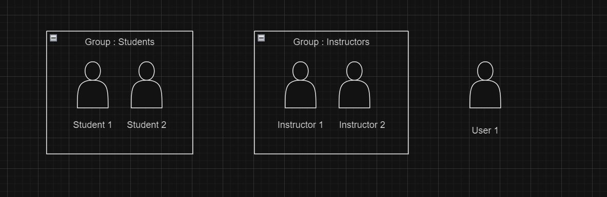
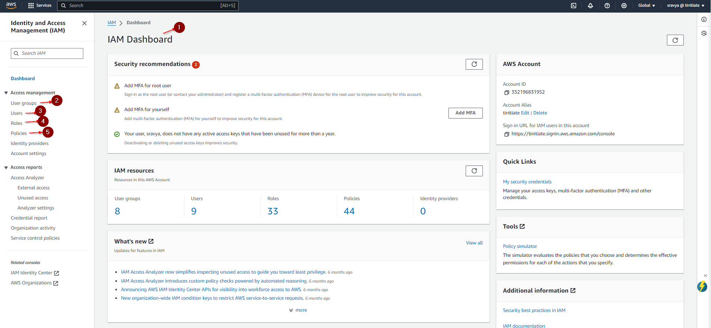

# AWS Identity and Access Management (IAM) Documentation

## Overview
* Identity and Access Management, Global service - controls access to AWS and its resources.
* AWS Identity and Access Management (IAM) enables you to manage access to AWS services and resources securely. 
* Using IAM, you can create and manage AWS users and groups, and use permissions to allow and deny their access to AWS resources.
* In essence, IAM helps you control who can access what within your AWS cloud environment, ensuring security and compliance.

## IAM Core Components

### 1. IAM Users
- **Description**: Represents an individual or service that interacts with AWS resources.
- **Common Uses**:
  - Accessing AWS Management Console.
  - Interacting with AWS services programmatically via the API.
    
### 2. IAM User Groups
- **Description**: A collection of IAM users under a set of permissions.
- **Common Uses**:
  - Simplifying permission management for multiple users.
  - Organizing users by department or role (e.g., devops group, finance group).

<p align="center">
  
</p>

#### IAM Permissions
- **Description**: Defines what actions are allowed or denied on users, user groups and aws resources.
- **Common Uses**:
  - Restricting access to specific AWS services or functionalities (e.g., allowing read-only access to an S3 bucket).
  - Controlling the level of access a user or service has (e.g., granting full access vs. read-only access).

### 4. IAM Roles
- **Description**: Enables you to delegate permissions to AWS services or external users.
- **Common Uses**:
  - Granting permissions to AWS services like Lambda functions to interact with other AWS resources without needing a separate IAM user.
  - Allowing users from another AWS account to access specific resources in your account in a secure way.
  
    
### 3. IAM Policies
- **Description**: Documents that define permissions and can be attached to users, groups, roles, or even resources.
- **Common Uses**:
  - Specifying allowed or denied actions and the conditions under which actions are allowed for a user, group, role, or resource.
  - Managing permissions centrally through policy documents which helps in achieving consistent security posture across resources.
    
All the IAM Core components can be accessed from IAM dashboard as shown below.

<p align="center">
  
</p>

## Additional Features


### Multi-Factor Authentication (MFA)
- **Description**: Adds an extra layer of security by requiring a second form of authentication for users
- **Common Uses**:
  - Enhancing security for accessing the AWS console.
  - Protecting sensitive transactions.

### Access Keys
- **Description**: Access keys consist of an access key ID and a secret access key, which are used to sign programmatic requests to AWS.
- **Common Uses**:
  - Enabling programmatic access to AWS services via AWS CLI, SDKs, or APIs.
  - Allowing applications to authenticate and interact with AWS resources without manual login.
- **Best Practices**:
  - **Rotate Access Keys Regularly**: Change access keys periodically to reduce the risk of compromise.
  - **Do Not Embed Access Keys Directly in Code**: Use environment variables or AWS Secrets Manager to store access keys securely.
  - **Delete Unused Access Keys**: Regularly audit and remove access keys that are no longer in use.


## Best Practices

* Enforcing Strong Password Policies - Implement requirements for password complexity and rotation to enhance security.
* Principle of Least Privilege - Ensure that IAM policies grant the minimum permissions necessary to perform job functions.
* Regular Audits - Conduct regular audits of your IAM settings to ensure they meet your current business needs and comply with your security policies.

## IAM Policy Examples

### Read-Only Access to an S3 Bucket
#### What is an S3 Bucket? 
An S3 bucket is a virtual container within AWS Simple Storage Service (S3) designed to store and manage any amount of data.

Here's an example of a policy that grants read-only access to an S3 bucket:
```json
{
  "Version": "2012-10-17",
  "Statement": [
    {
      "Effect": "Allow",
      "Action": ["s3:Get*", "s3:List*"],
      "Resource": ["arn:aws:s3:::example-bucket/*"]
    }
  ]
}
```
