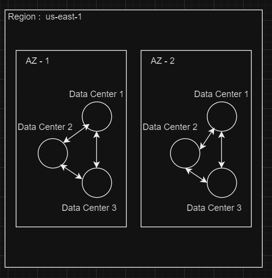

# AWS Cloud Computing

Amazon Web Services (AWS) offers reliable, scalable, and inexpensive cloud computing services. AWS is a comprehensive and broadly adopted cloud platform that offers over 200 fully-featured services from data centers globally. 
It powers a wide range of infrastructure services, such as computing power, storage options, networking, and databases, offered on-demand, with pay-as-you-go pricing.

## On-Premises vs. Cloud
| Aspect                  | On-Premises                               | AWS Cloud                                  |
|-------------------------|-------------------------------------------|--------------------------------------------|
| **Capital Costs**       | High initial investment for infrastructure. | Low initial cost with pay-as-you-go billing. |
| **Maintenance**         | Managed by internal IT; requires upkeep and updates. | Handled by AWS, reducing internal workload. |
| **Scalability**         | Time-consuming and costly to scale.       | Easily scalable with minimal delay.        |
| **Security**            | Managed in-house, requiring significant resources. | Provided by AWS with top-tier security measures. |
| **Disaster Recovery**   | Complex and expensive to implement.       | Simplified and cost-effective solutions.   |
| **Global Reach**        | Limited by physical infrastructure.       | Quick deployment globally with reduced latency. |

## Benefits of AWS

  

* Scalability: AWS provides scalable computing resources which means you only use what you need and can scale up or down as required.
* Cost-Effective: With AWS, you pay only for the computing power, storage, and other resources you use, with no long-term contracts or upfront commitments.
* Security: AWS utilizes an end-to-end approach to secure and harden its infrastructure, including physical, operational, and software measures.
* Flexibility and Openness: AWS supports multiple programming languages, operating systems, and databases, making it a flexible choice for software developers.
* Reliability: AWS offers a highly reliable environment where replacement instances can be rapidly and predictably commissioned.

## AWS Global Infrastructure
AWS maintains a massive global infrastructure that enhances the performance of its cloud services and offers high availability to its users.

* AWS Regions: These are specific areas around the world where AWS clusters data centers.
  Each AWS Region is a separate geographic area that allows users to choose the locality of their services to meet specific regulatory or compliance requirements.
* Availability Zones: Within each region, AWS operates multiple isolated locations known as Availability Zones.
  Each zone is made up of one or more data centers equipped with independent power, cooling, and networking.
* Data Centers: AWS Data Centers are highly secure facilities that house the hardware and systems which power the various AWS services.
  They are strategically located in Availability Zones all over the world to ensure redundancy and resilience of AWS services.

  

## Tools to access AWS Environment
1. AWS Management Console :The web-based interface where you can manage all AWS services. It provides a visual interface to monitor and control your resources.
   [AWS Management Console] (https://us-east-1.console.aws.amazon.com/console/home?nc2=h_ct&src=header-signin&region=us-east-1)
2. Command Line :Allows you to control AWS services from the command line and automate them through scripts.
3. Cloud Shell :AWS CloudShell is a browser-based shell that makes it easy to securely manage, explore, and interact with your AWS resources.
   
