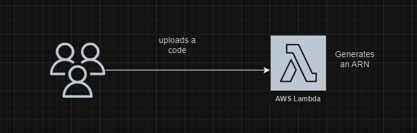
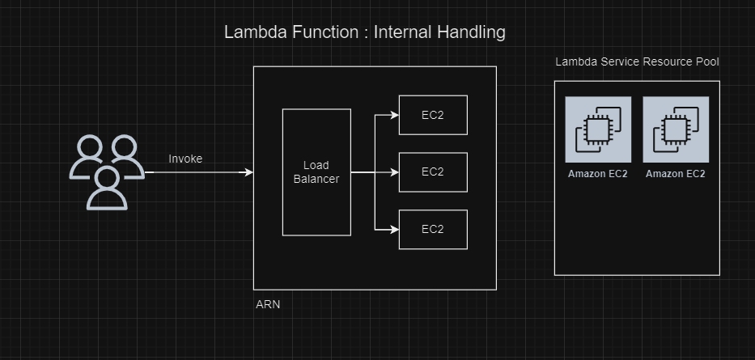

# Overview of AWS Lambda Functions

The individual functions you write and deploy within the AWS Lambda service. Each Lambda function is a piece of code that performs a specific task and is executed in response to an event. 

## Core Concepts of Lambda Functions
* Triggers: Events that invoke your function. Examples include changes in data within an S3 bucket, updates to a DynamoDB table, HTTP requests via API Gateway, and schedule events from CloudWatch.
* Function Code: The code you write to handle events. It can include libraries and dependencies.
* Runtime: The execution environment that runs your function. You select a runtime that corresponds to your choice of programming language.
* Resources: Configuration settings that you provide, such as memory and execution time.
* IAM Role: The IAM policy that grants your function permission to access AWS resources

## How Lambda Function works internally?

  

  

